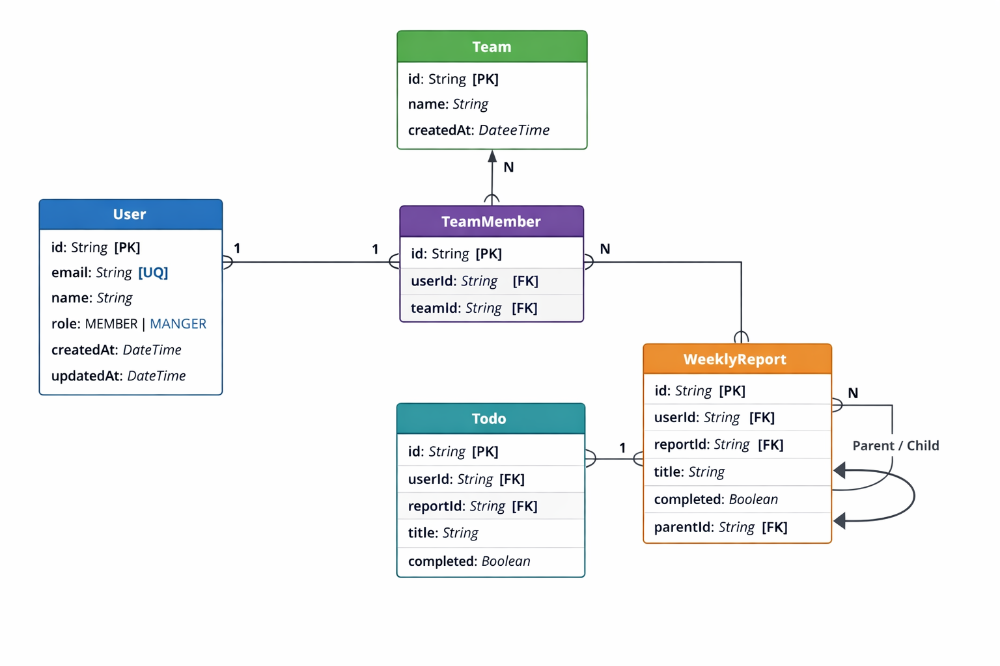

# Teamflow

AI 기반 **주간보고 요약 & Todo 자동 생성** 협업 서비스 API

---

## 📌 Overview

**Teamflow**는 팀원이 작성한 주간보고를 기반으로

- 팀장은 **AI 요약본**으로 팀 현황을 빠르게 파악하고
- 팀원은 보고 내용에서 **Todo를 자동 생성**하여 업무를 관리할 수 있는

B2B 협업 서비스입니다.

본 프로젝트는 **중견기업 지원용 포트폴리오**를 목표로 설계 및 구현되었습니다.

---

## ✨ Features

- 주간보고 작성 및 팀 단위 관리
- AI 기반 주간보고 요약
- 보고 내용 기반 Todo 자동 생성
- Todo Sub-task (부모–자식 구조) 지원
- 팀장 / 팀원(Role) 기반 권한 분리

---

## 🛠 Tech Stack

- **Node.js** 20
- **TypeScript**
- **PostgreSQL** 15
- **Prisma ORM**
- **OpenAI API** (예정)

## Database Schema (ERD)


---

## 🧱 Architecture

- REST API 기반 서버 구조
- Role 기반 접근 제어 (MANAGER / MEMBER)
- Prisma ORM을 활용한 명확한 도메인 모델링
- Self-relation을 활용한 Todo 계층 구조 설계

---

## 📂 Project Structure

```
teamflow-api/
 ├ prisma/
 │  └ schema.prisma
 ├ src/
 ├ docs/
 │  └ setup-log.md
 ├ .env
 └ README.md
```

---

## 📄 Documentation

- [Setup & Troubleshooting Log](docs/setup-log.md)

> 환경 설정, Prisma 관련 트러블슈팅 및 기술 선택 과정은 위 문서에 정리되어 있습니다.

---

## 🚀 Roadmap

- [ ] 인증 (JWT 기반)
- [ ] WeeklyReport CRUD API
- [ ] AI 요약 기능 연동
- [ ] 주간보고 → Todo 자동 생성 플로우
- [ ] 팀장 / 팀원 권한 분기 API

---

## 👤 Author

**Yujin Kim**
